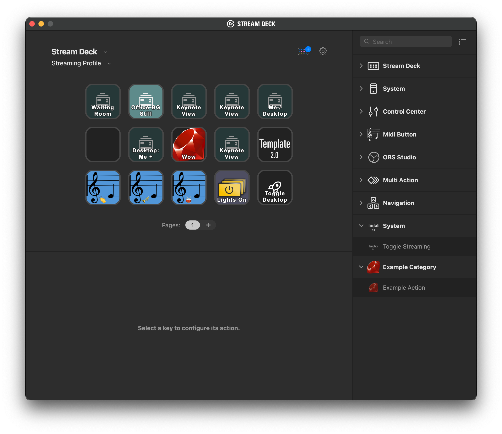

# Example Stream Deck Plugin in Ruby

This is an example of a stream deck plugin written in Ruby.

The Stream Deck communicates with plugins via Web Sockets.  The [`manifest.json`](/src/com.example.example-plugin.sdPlugin/manifest.json) file tells the Stream Deck how to find the plugin executable and also specifies the icons.
The Stream Deck app will start the executable file, and pass connection information to the executable.
The executable must connect to the web socket, then let the Stream Deck know it has connected by sending a particular request.

In this example project, we specify [`plugin.rb`](/src/com.example.example-plugin.sdPlugin/manifest.json#L4) as the executable.
You can find the source for the plugin [here](/src/com.example.example-plugin.sdPlugin/plugin.rb).

## Installation

Just do this:

```
$ ln -s (realpath src/com.example.example-plugin.sdPlugin) ~/Library/Application\ Support/com.elgato.StreamDeck/Plugins/
```

Then restart the Stream Deck app.  The plugin should now be available!



## Development

It seems like you have to restart the Stream Deck app every time you want to restart the script. 🤷‍♀️
